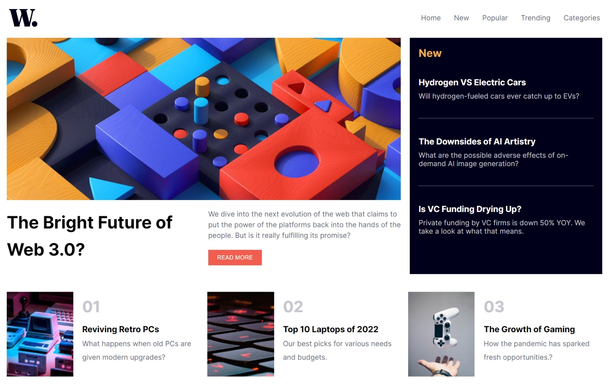

# Frontend Mentor - News homepage solution

This is a solution to the [News homepage challenge on Frontend Mentor](https://www.frontendmentor.io/challenges/news-homepage-H6SWTa1MFl). Frontend Mentor challenges help you improve your coding skills by building realistic projects. 

## Table of contents

  - [Features](#features)
  - [Screenshots](#screenshots)
  - [Links](#links)
- [My process](#my-process)
  - [Built with](#built-with)
  - [What I learned](#what-i-learned)
  - [Continued development](#continued-development)
  - [Useful resources](#useful-resources)


### Features

Users should be able to:

- View the optimal layout for the interface depending on their device's screen size
- See hover and focus states for all interactive elements on the page
- **Bonus**: Toggle the mobile menu (Implemented JavaScript)

### Screenshots

#### Mobile screenshot


#### Desktop screenshot



### Links

<!-- - Solution URL: [Add solution URL here](https://your-solution-url.com) -->
- Live Site URL: [click me](https://tk-ls97.github.io/news-homepage/)

## My process

The landing page was built with the mobile user in-mind, but optimized for desktop as well. I was able to implement a flexible layout using flexbox and CSS grid as they tend to work so well together. 


### Built with

- Semantic HTML5 markup
- CSS custom properties
- SCSS
- Flexbox
- CSS Grid
- Mobile-first workflow
- Vanilla Javascript

### What I learned

I got to implement CSS grid more and in depth and that was a good flex workout for me.

I also got to use Javascript to display and hide the mobile hamburger menu which was fun to create. I had to manipulate CSS through JS as well.


```js
const ham = document.querySelector(".hamburger");
const nav = document.querySelector(".nav-mobile");


ham.addEventListener("click",()=>{   //When hamburger menu is clicked do this
    
    //Toggle and add ".active" class to .hamburger class Element
    ham.classList.toggle("active");

    //same here for .nav-mobile
    nav.classList.toggle("active");
})
```


### Useful resources

- [KEVIN POWELL on YouTube](https://www.youtube.com/@KevinPowell) - This helped me with css Grid

